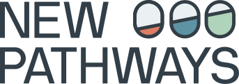

# NEWPATHWAYS Scenario Processing Workflow

Copyright 2025 IIASA and the NEWPATHWAYS consortium

## Overview

The NEWPATHWAYS project aims to inform solutions to strengthen climate action by developing and analysing next-generation Paris-aligned global and national low-emission transformation pathways for the Global Stocktake in 2028.

## Funding acknowledgement

Funded by the European Union. Views and opinions expressed are however those of the author(s) only and do not necessarily reflect those of the European Union or the European Climate, Infrastructure and Environment Executive Agency (CINEA). Neither the European Union nor the granting authority can be held responsible for them.
